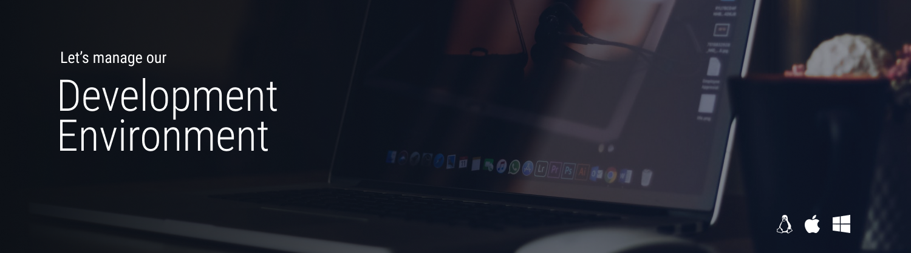

An interactive course about technologies and techniques to manage our development environments and keep them clean.

<!-- TODO: Rephrase -->
We will take a look at good pratices used by developers all over the world. Anyway, we will focus on techniques that fit in the area of web development as it is our main use case.

The course will be split into two major sections. One addresses our [personal environments](#part-1-personal-environment), the second one adresses shared [project environments](#part-2-project-environment).

## Prerequisites

## Part 1: **Personal Environment** 
You local environment could be:
- Actual machine
- Virtual machine
- Container / Subsystem
- Linux, MacOS, Windows

We will be using
- Visual Studio Code
- Git
## Part 2: **Project Environment** 
